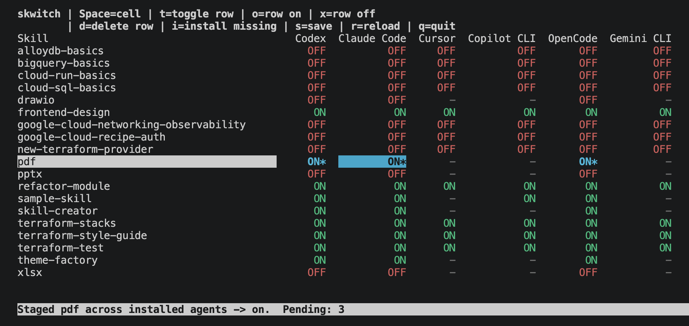

<p align="center">
  <a href="./README.md">en</a> | ja
</p>

# skill-switch

`skill-switch` は、複数の Agent Skill の有効/無効をエージェント横断でまとめて切り替える TUI です。



## 特長

- 各 Agent の user level skill をひとつのテーブルで横断的に On/Off、インストール、削除できます。
- On/Off の切り替えは skill ディレクトリの rename ではなく、各 Agent の native な有効/無効設定を更新します。
- インストールは `gh skill install` コマンドと連携し、provenance metadata がない場合は local copy に fallback します。
- runtime package dependency はありません。

## 対応 Agent

Agent ID は `gh skill install --help` の括弧内の名称に合わせています。
`universal` は skill-switch 内で `~/.agents/skills` を表す列です。この列への install は gh の
`universal` agent を使います。表では左端に表示されます。

| Agent              | ID               | User skill folders          | 反映先                                                                          |
| ------------------ | ---------------- | --------------------------- | ------------------------------------------------------------------------------- |
| Universal          | `universal`      | `~/.agents/skills`          | Claude Code 以外の Universal 対応 Agent 向け設定をまとめて書き込み              |
| Codex              | `codex`          | `~/.codex/skills`           | `~/.codex/config.toml` の `[[skills.config]]` に `path` と `enabled` を書き込み |
| Claude Code        | `claude-code`    | `~/.claude/skills`          | `~/.claude/settings.json` の `skillOverrides` を書き込み                        |
| Cursor             | `cursor`         | `~/.cursor/skills`          | 各 skill の `SKILL.md` frontmatter に `disable-model-invocation` を書き込み     |
| GitHub Copilot CLI | `github-copilot` | `~/.copilot/skills`         | `~/.copilot/settings.json` の `disabledSkills` を書き込み                       |
| OpenCode           | `opencode`       | `~/.config/opencode/skills` | `~/.config/opencode/opencode.json` の `permission.skill` を書き込み             |
| Gemini CLI         | `gemini-cli`     | `~/.gemini/skills`          | `~/.gemini/settings.json` の `skills.disabled` を書き込み                       |

TUI と `list` では、user skill folder が存在する列だけを表示します。行全体への操作と
デフォルトの `install-missing` 対象も、その active な列だけです。bootstrap 用途では
`install-missing` に Agent ID を明示指定できます。

Cursor は Codex のような path ベースの一括 On/Off 設定を公開していないため、このツールでは `disable-model-invocation` を使います。これは自動呼び出しを止める設定で、明示呼び出しの扱いは Cursor 側の仕様に従います。

`~/.cursor/skills-cursor` は Cursor が管理するディレクトリなので、このツールでは対象外です。

Skill の一致判定は `SKILL.md` frontmatter の `name` で行います。`name` がない場合は親ディレクトリ名を使います。

On/Off の書き込みは次のルールに従います。

| Agent              | OFF の書き込み                                                                                                          | ON の書き込み                                                             |
| ------------------ | ----------------------------------------------------------------------------------------------------------------------- | ------------------------------------------------------------------------- |
| Codex              | `enabled = false` を追加/更新                                                                                           | その skill の `[[skills.config]]` エントリを削除                          |
| Claude Code        | `skillOverrides[name] = off`                                                                                            | `skillOverrides[name]` を削除                                             |
| Cursor             | `disable-model-invocation` を設定                                                                                       | `disable-model-invocation` を削除                                         |
| GitHub Copilot CLI | `disabledSkills` に追加                                                                                                 | `disabledSkills` から削除                                                 |
| OpenCode           | `permission.skill[name]=deny`                                                                                           | 上位の deny rule を上書きできるよう `permission.skill[name]=allow` を明示 |
| Gemini CLI         | `skills.disabled` に追加                                                                                                | `skills.disabled` から削除し、必要なら `skills.enabled = true` は維持     |
| Universal          | `~/.agents/skills` の path/name に対して Codex、Cursor、Copilot CLI、OpenCode、Gemini CLI の OFF 設定をまとめて書き込み | 同じ対象に ON 設定をまとめて書き込み                                      |

明示的な ON エントリが既にある状態で OFF にする場合は、各 Agent の OFF 形式へ上書きします。
たとえば Codex の `enabled = true` は `enabled = false` に、Claude Code の
`skillOverrides[name] = on` は `off` に、Cursor の `disable-model-invocation: false` は
`true` に、OpenCode の `allow` は `deny` になります。

Agent 個別の列は、その Agent の primary user skill folder にある skill だけを制御します。
同名の Universal skill には作用しません。Universal 列は `~/.agents/skills` の skill だけを
対象にし、Universal 対応 Agent 向けの設定をまとめて書き込みます。Claude Code は公式の skill
location に `~/.agents/skills` を含まないため対象外です。

Universal toggle の対象:

| Agent              | Universal の対象 | `~/.agents/skills` に対して触る設定       |
| ------------------ | ---------------- | ----------------------------------------- |
| Codex              | Yes              | `~/.codex/config.toml` の path entry      |
| Claude Code        | No               | 触りません                                |
| Cursor             | Yes              | Universal skill の `SKILL.md` frontmatter |
| GitHub Copilot CLI | Yes              | `~/.copilot/settings.json`                |
| OpenCode           | Yes              | `~/.config/opencode/opencode.json`        |
| Gemini CLI         | Yes              | `~/.gemini/settings.json`                 |

## 使い方

`skill-switch` コマンドとして使いたい場合:

```bash
pnpm link --global
skill-switch
```

リポジトリから直接起動する場合:

```bash
pnpm start
```

引数なしで起動すると TUI を開きます。

確認、snapshot、dry-run install 用の補助コマンドを用意しています。

```bash
node src/cli.ts help
node src/cli.ts --version
node src/cli.ts list
node src/cli.ts list --format json
node src/cli.ts export > skills.json
node src/cli.ts import skills.json
node src/cli.ts apply skills.json
node src/cli.ts install-missing frontend-design
node src/cli.ts install-missing frontend-design universal cursor --execute
```

`export` は再現可能な `on`/`off` 状態を JSON snapshot として出力します。`mixed` と
missing 状態は省略します。

```json
{
  "version": 1,
  "skills": {
    "frontend-design": {
      "codex": "on",
      "claude-code": "off"
    }
  }
}
```

`import skills.json` は snapshot との差分を未適用変更として読み込んだ状態で TUI を開きます。
確認してから `a` で apply できます。`apply skills.json` は TUI を開かずに同じ snapshot を
直接反映するため、dotfiles や bootstrap script に向いています。

`install-missing` は、既にインストール済みの skill の `SKILL.md` から
`metadata.github-repo` と `metadata.github-path` を読み取り、その skill が存在しない
Agent 向けの `gh skill install --scope user --agent ...` コマンドを作ります。デフォルトでは
コマンド表示だけを行い、`--execute` を付けた場合だけ実行します。
GitHub provenance がない場合は、既存の local skill directory を missing Agent の primary
user skill folder へコピーします。
local copy 時は `SKILL.md` frontmatter を sanitize し、Agent Skills spec の field である
`name`, `description`, `license`, `compatibility`, `metadata`, `allowed-tools` だけを残します。
複数の列をインストール元として使える場合は、Universal、Codex、Claude Code、Cursor、
GitHub Copilot CLI、OpenCode、Gemini CLI の順で最初に見つかったものを使います。

TUI でも同じ操作ができます。skill 行を選んで `i` を押し、`y` で確認すると、その skill が
存在しない対応 Agent へまとめてインストールします。
GitHub provenance を使う経路では `gh skill install` が必要です。local copy fallback では
`gh` は不要です。

## TUI

ステータス色:

| Status     | 色                   |
| ---------- | -------------------- |
| `ON`       | 緑                   |
| `OFF`      | 赤                   |
| `MIX`      | 黄                   |
| `-`        | グレー               |
| 未保存変更 | `*` 付きの太字シアン |

Universal が mixed の場合は `2/3` のように `enabled/total` で表示します。分母は active かつ
Universal aligned な Agent 数、分子はそのうち Universal skill が有効な Agent 数です。

キー操作:

| Key                     | コマンド        | 動作                                             |
| ----------------------- | --------------- | ------------------------------------------------ |
| `Up`/`Down`, `j`/`k`    | move row        | skill 行を移動                                   |
| `Left`/`Right`, `h`/`l` | move column     | Agent 列を移動                                   |
| `Space`                 | toggle cell     | 選択中のセルだけ On/Off                          |
| `t`                     | toggle row      | 選択中の skill 行を、存在する Agent 全体でトグル |
| `o`                     | row on          | 選択中の skill 行を、存在する Agent 全体で ON    |
| `x`                     | row off         | 選択中の skill 行を、存在する Agent 全体で OFF   |
| `d`                     | delete skill    | 選択中の skill を、存在する Agent 全体で削除     |
| `i`                     | install missing | 選択中の skill を未導入 Agent へ入れる準備       |
| `y`/`n`                 | confirm/cancel  | 準備したインストールの実行/キャンセル            |
| `a`                     | apply           | 未保存変更を各 Agent の設定へ反映                |
| `r`                     | reload          | ディスクから再読み込みし、未保存変更を破棄       |
| `q`                     | quit            | 終了                                             |

Advanced keys:

| Key | コマンド    | 動作                                                                                                 |
| --- | ----------- | ---------------------------------------------------------------------------------------------------- |
| `f` | frontmatter | Frontmatter pane の展開/折りたたみを切り替えます。隠れている残り行数は pane title に表示されます。   |
| `v` | column view | active な列だけの表示と、supported agent 全列表示を切り替えます。inactive な列名は薄く表示されます。 |

## 参考

- Codex Agent Skills docs: https://developers.openai.com/codex/skills
- Claude Code Skills docs: https://code.claude.com/docs/en/skills
- Cursor Agent Skills forum guidance: https://forum.cursor.com/t/can-i-run-cursor-cli-without-loading-skills-or-with-only-specific-skill/152608
- GitHub Copilot CLI docs: https://docs.github.com/copilot/reference/copilot-cli-reference/cli-command-reference
- OpenCode Agent Skills docs: https://opencode.ai/docs/skills/
- Gemini CLI configuration docs: https://github.com/google-gemini/gemini-cli/blob/main/docs/reference/configuration.md

### gh

```sh
 $ gh skill install --help | grep '  - '
  - GitHub Copilot (github-copilot)
  - Claude Code (claude-code)
  - Cursor (cursor)
  - Codex (codex)
  - Gemini CLI (gemini-cli)
  - Antigravity (antigravity)
  - AdaL (adal)
  - Amp (amp)
  - Augment (augment)
  - IBM Bob (bob)
  - Cline (cline)
  - CodeBuddy (codebuddy)
  - Command Code (command-code)
  - Continue (continue)
  - Cortex Code (cortex)
  - Crush (crush)
  - Deep Agents (deepagents)
  - Droid (droid)
  - Firebender (firebender)
  - Goose (goose)
  - iFlow CLI (iflow-cli)
  - Junie (junie)
  - Kilo Code (kilo)
  - Kimi Code CLI (kimi-cli)
  - Kiro CLI (kiro-cli)
  - Kode (kode)
  - MCPJam (mcpjam)
  - Mistral Vibe (mistral-vibe)
  - Mux (mux)
  - Neovate (neovate)
  - OpenClaw (openclaw)
  - OpenCode (opencode)
  - OpenHands (openhands)
  - Pi (pi)
  - Pochi (pochi)
  - Qoder (qoder)
  - Qwen Code (qwen-code)
  - Replit (replit)
  - Roo Code (roo)
  - Trae (trae)
  - Trae CN (trae-cn)
  - Universal (universal)
  - Warp (warp)
  - Windsurf (windsurf)
  - Zencoder (zencoder)
```

## 今後の予定

- Claude Code の `skillOverrides` について、ON/OFF 以外の `"name-only"` と
  `"user-invocable-only"` も扱えるようにする。
