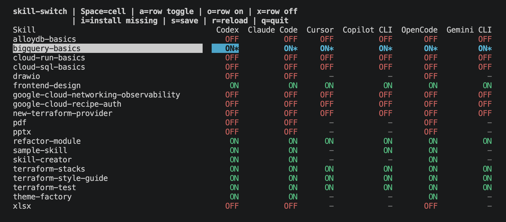

<p align="center">
  <a href="./README.md">en</a> | <a href="./README_ja.md">ja</a>
</p>

# skwitch

`skwitch` は、複数の Agent Skill の有効/無効をエージェント横断でまとめて切り替える TUI です。

Skill の一致判定は `SKILL.md` frontmatter の `name` で行います。`name` がない場合は親ディレクトリ名を使います。



## 特長

- 対応 Agent の skill をひとつのテーブルで横断的に On/Off できます。
- skill ディレクトリの rename ではなく、各 Agent の native な有効/無効設定を使います。
- provenance metadata がある場合、`gh skill install` で未導入 Agent へ skill を追加できます。
- runtime package dependency はありません。

## 対応 Agent

Agent ID は `gh skill install --help` の括弧内の名称に合わせています。

| Agent              | ID               | User skill folders                                                  | 反映先                                                                          |
| ------------------ | ---------------- | ------------------------------------------------------------------- | ------------------------------------------------------------------------------- |
| Codex              | `codex`          | `~/.agents/skills`, `~/.codex/skills`                               | `~/.codex/config.toml` の `[[skills.config]]` に `path` と `enabled` を書き込み |
| Claude Code        | `claude-code`    | `~/.claude/skills`                                                  | `~/.claude/settings.json` の `skillOverrides` を書き込み                        |
| Cursor             | `cursor`         | `~/.cursor/skills`                                                  | 各 skill の `SKILL.md` frontmatter に `disable-model-invocation` を書き込み     |
| GitHub Copilot CLI | `github-copilot` | `~/.copilot/skills`, `~/.agents/skills`                             | `~/.copilot/settings.json` の `disabledSkills` を書き込み                       |
| OpenCode           | `opencode`       | `~/.config/opencode/skills`, `~/.claude/skills`, `~/.agents/skills` | `~/.config/opencode/opencode.json` の `permission.skill` を書き込み             |
| Gemini CLI         | `gemini-cli`     | `~/.gemini/skills`                                                  | `~/.gemini/settings.json` の `skills.disabled` を書き込み                       |

Cursor は Codex のような path ベースの一括 On/Off 設定を公開していないため、このツールでは `disable-model-invocation` を使います。これは自動呼び出しを止める設定で、明示呼び出しの扱いは Cursor 側の仕様に従います。

`~/.cursor/skills-cursor` は Cursor が管理するディレクトリなので、このツールでは対象外です。

## 使い方

`skwitch` コマンドとして使いたい場合:

```bash
pnpm link --global
skwitch
```

リポジトリから直接起動する場合:

```bash
pnpm start
```

引数なしで起動すると TUI を開きます。

確認や dry-run install 用の補助コマンドとして、`list` と `install-missing` だけ残しています。

```bash
node src/cli.ts help
node src/cli.ts --version
node src/cli.ts list
node src/cli.ts list --format json
node src/cli.ts install-missing frontend-design
node src/cli.ts install-missing frontend-design cursor --execute
```

`install-missing` は、既にインストール済みの skill の `SKILL.md` から
`metadata.github-repo` と `metadata.github-path` を読み取り、その skill が存在しない
Agent 向けの `gh skill install --scope user --agent ...` コマンドを作ります。デフォルトでは
コマンド表示だけを行い、`--execute` を付けた場合だけ実行します。
複数 Agent に同じ skill の provenance がある場合は、Codex、Claude Code、Cursor、
GitHub Copilot CLI、OpenCode、Gemini CLI の順で最初に見つかったものを使います。

TUI でも同じ操作ができます。skill 行を選んで `i` を押し、`y` で確認すると、その skill が
存在しない対応 Agent へまとめてインストールします。
実際のインストールには `gh skill install` が必要です。dry-run の `install-missing` は
`gh` がなくてもコマンド表示だけ行えます。

## TUI

ステータス色:

| Status     | 色                   |
| ---------- | -------------------- |
| `ON`       | 緑                   |
| `OFF`      | 赤                   |
| `MIX`      | 黄                   |
| `-`        | グレー               |
| 未保存変更 | `*` 付きの太字シアン |

キー操作:

| Key                     | コマンド        | 動作                                             |
| ----------------------- | --------------- | ------------------------------------------------ |
| `Up`/`Down`, `j`/`k`    | move row        | skill 行を移動                                   |
| `Left`/`Right`, `h`/`l` | move column     | Agent 列を移動                                   |
| `Space`                 | toggle cell     | 選択中のセルだけ On/Off                          |
| `a`                     | toggle row      | 選択中の skill 行を、存在する Agent 全体でトグル |
| `o`                     | row on          | 選択中の skill 行を、存在する Agent 全体で ON    |
| `x`                     | row off         | 選択中の skill 行を、存在する Agent 全体で OFF   |
| `i`                     | install missing | 選択中の skill を未導入 Agent へ入れる準備       |
| `y`/`n`                 | confirm/cancel  | 準備したインストールの実行/キャンセル            |
| `s`                     | save            | 未保存変更を保存                                 |
| `r`                     | reload          | ディスクから再読み込みし、未保存変更を破棄       |
| `q`                     | quit            | 終了                                             |

## 参考

- Codex Agent Skills docs: https://developers.openai.com/codex/skills
- Claude Code Skills docs: https://code.claude.com/docs/en/skills
- Cursor Agent Skills forum guidance: https://forum.cursor.com/t/can-i-run-cursor-cli-without-loading-skills-or-with-only-specific-skill/152608
- GitHub Copilot CLI docs: https://docs.github.com/copilot/reference/copilot-cli-reference/cli-command-reference
- OpenCode Agent Skills docs: https://opencode.ai/docs/skills/
- Gemini CLI configuration docs: https://github.com/google-gemini/gemini-cli/blob/main/docs/reference/configuration.md
